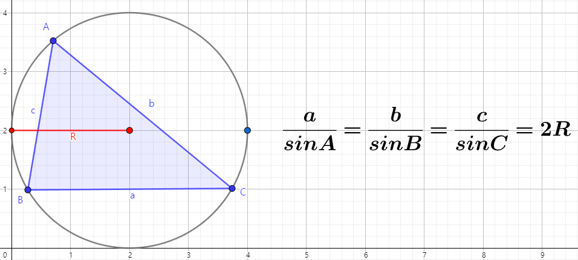

# 사인법칙 그리고 코사인법칙

## 목표
> 사인법칙과 코사인법칙을 사용하는 이유와 사용 방법 대해 알아보자. 

## 사인 법칙

### Why?
삼각형의 2각을 알고, 하나의 변의 길이를 알 때,
다른변의 길이를 구할 때 쓴다. 
### How?

## 제1 코사인 법칙
### Why?
삼각형의 2개의 변과 1개의 각을 이용해 나머지 하나의 변을 구할 때 쓴다.
삼각형의 3개의 변을 이용해 하나의 각을 구할 때 쓴다.
### How?

## 제2 코사인 법칙
